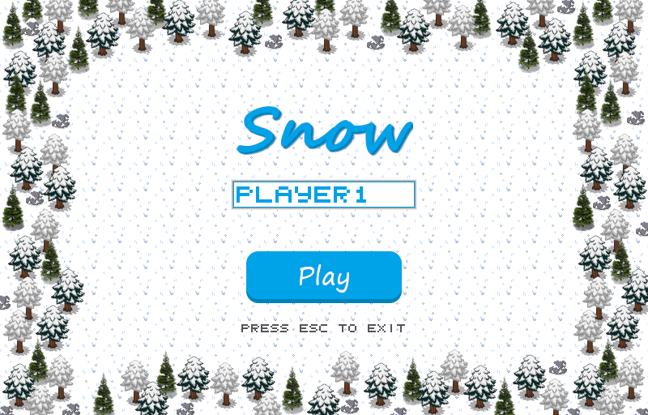

# Snow

*
BUas  intake assignment made in C++ with SDL2
*

#### Download the game from: [https://boyko03.itch.io/snow](https://boyko03.itch.io/snow)

---

<h3>Features</h3>

Ski game  
- Two modes: Slalom (finite) and Off-road (endless)  
- Three difficulties: easy, medium and hard  
- Randomly generated terrain  
- Powerups  
- Ranking

---

<h3>Controls:</h3>
<ul>
<li>A / Left Arrow to turn left</li>
<li>D / Right Arrow to turn right</li>
<li>W / Up Arrow to slow down</li>
<li>Hold S / Down Arrow to accelerate</li><li>P to pause</li>
<li>Enter / Space for select</li>
<li>F11 for fullscreen</li>
<li>PrtScr to take a screenshot</li>
<li>Esc to exit / go back</li>
</ul>

---

